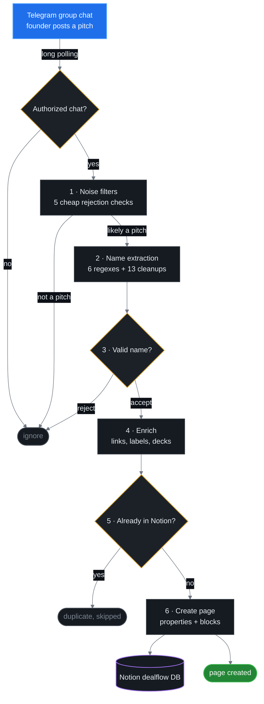

<h1 align="center">Veris Dealflow Bot</h1>

<p align="center">
  A Telegram bot that reads inbound venture deals out of a group chat, decides which messages are
  actually company pitches, and writes each one into Notion as a structured dealflow record.
</p>

<p align="center">
  
  
  
  
  
</p>

---

## Why this exists

Veris Ventures sources crypto and blockchain deals through a Telegram group chat: founders and scouts drop
pitches straight into the conversation. Every one of those messages then had to be read, judged, renamed,
and hand-copied into the firm's Notion dealflow database — links re-pasted, decks noted, duplicates caught
by memory. It cost roughly **five hours of manual triage a week**, and the database drifted out of date the
moment anyone got busy.

This bot removes that step entirely. It watches the group, classifies each message, extracts the company
name and every useful link, checks whether the company is already tracked, and creates the Notion page
itself — then replies in-thread so the team can see what it did without leaving Telegram.

|  |  |
|---|---|
| **Deals captured** | up to ~10 new Notion pages per week at peak |
| **Manual work removed** | ~5 hours/week of reading, renaming, and copy-pasting |
| **Run cadence** | scheduled job, 3x per week |
| **Human steps per deal** | 1 — post the pitch |
| **Duplicate records created** | 0 — every write is checked against the live database first |

---

## How it works

The interesting part of this project is not the API plumbing, it is the **classifier**. A group chat message
is unstructured text with no schema, no consistent format, and no flag saying "this one is a deal." The bot
has to decide that on its own, and a false positive is worse than a miss — it pollutes the database the
investment team relies on. So detection runs as a six-stage pipeline that gets progressively more
expensive, with the cheapest rejections first.



### 1 — Noise filters

Most messages in any chat are not pitches, so the bot spends as little as possible ruling them out. Five
checks run before a single extraction regex is applied:

- **Minimum length** — anything under 50 characters cannot carry a real pitch.
- **News-article detector** — a frozenset of publication names and domains (`theblock.co`, `coindesk.com`,
  `reuters.com`, `techcrunch.com`, ...) combined with wire-copy vocabulary (`announces`, `raises`,
  `funding round`, `partnership`, `revenue sharing`). Two or more hits and the message is treated as a
  shared article rather than a pitch. This matters because a funding announcement reads almost exactly
  like a pitch, and it was the single largest source of false positives.
- **Conversational-opener detector** — messages beginning with `hey`, `btw`, `great to speak`, `here is`,
  `our deck`, `some additional info`, and similar. Follow-up chatter about a deal should not create a
  second record for it.
- **Indicator density** — the message must contain at least two "strong indicators" drawn from a
  vocabulary of pitch and sector language (`is a`, `unified`, `protocol`, `enables`, `core features`,
  `backed by`, `business model`, `rwa`, `defi`, ...).
- **Keyword presence** — a domain-weighted keyword set covering both generic startup language
  (`platform`, `we provide`, `solution`) and the crypto vocabulary this dealflow actually uses
  (`liquidity`, `staking`, `derivatives`, `collateral`, `settlement`, `composable`).

### 2 — Name extraction

Once a message survives the filters, six regexes with named capture groups compete to pull the company name
out of it. They cover the phrasings founders genuinely use:

| Pattern | Matches |
|---|---|
| `<Name> is / provides / enables / unlocks ...` | `Helix Protocol is a unified margin engine...` |
| `we are <Name> and we ...` | `We are Helix Protocol and we let traders...` |
| `<Name> - ...` / `<Name>: ...` | `Helix Protocol - cross-protocol margin...` |
| `introducing / presenting <Name> ...` | `Introducing Helix Protocol, the first...` |
| `<Name> is the / a ...`, anchored to line start | `Helix Protocol is the settlement layer...` |

Raw matches are messy, so 13 cleanup patterns strip the trailing prose that a greedy name group swallows
(`... on every chain`, `... protected by post-quantum cryptography`, inline parenthesised URLs, anything
after a comma). A **corporate-suffix whitelist** then re-anchors the result: if the name ends in
`Protocol`, `Labs`, `Network`, `Finance`, `Capital`, `Ventures`, `Systems`, `AI`, or `DAO`, the last two
tokens are taken as the company core — which is what rescues `Helix Protocol` from
`Fast Growing Helix Protocol`.

Every pattern in the bot is **compiled once at class-definition time**, not per message, so the hot path
does no regex compilation at all.

### 3 — Name validation

Extraction is optimistic by design, so a final gate rejects what slips through: names outside 3–50
characters, names longer than four words, all-lowercase strings, a stopword blocklist (`we`, `the`, `hey`,
`deck`, `link`, `documents`, ...), and nine compiled prefix patterns that catch bare URLs, `@handles`, and
`docs.` / `www.` fragments.

### 4 — Enrichment

A pitch is only as useful as the material attached to it, so before writing anything the bot:

- **Walks Telegram's `message.entities`** to recover hyperlinks. Telegram stores link targets as offset
  metadata separate from the message text, so a naive `message.text` read silently loses every URL hidden
  behind anchor text. The bot flattens each `text_link` entity back into `label (url)`, offset-adjusting as
  it rewrites the string so that later entities still land in the right place.
- **Deduplicates and labels URLs** by domain, so the Notion page says what each link *is* instead of
  showing a wall of raw URLs:

  | Domain | Label |
  |---|---|
  | `docsend.com` | Pitch Deck |
  | `loom.com` | Video Demo |
  | `crunchbase.com` / `pitchbook.com` | Crunchbase / PitchBook Profile |
  | `linkedin.com` / `x.com` / `github.com` | Founder and project profiles |
  | `calendly.com` | Schedule Meeting |
  | `gitbook.io` / `notion.site` | Documentation |

  Unknown domains fall back to `Link (domain)` rather than being dropped.
- **Flags PDF attachments**, so the record notes that a deck came with the original message.

### 5 — Duplicate prevention

Before creating anything, the bot queries the Notion database with a title-equals filter on the extracted
name. This makes writes **idempotent against the real database**, not merely against process memory — so a
company re-pitched weeks later, or after a restart, still will not produce a second page. Each attempt
resolves to `SUCCESS`, `DUPLICATE`, or `FAILED`, and the bot reports which one in its Telegram reply.

### 6 — The Notion record

Each new deal becomes a page with `Name`, `Created time` (taken from the Telegram message timestamp, not
the write time), and `Person` (the Telegram handle that submitted it), plus a body containing the full
original pitch in a quote block, an attachment note, and the labelled link list. Long messages are
truncated at 1,900 characters with an explicit marker, keeping the request inside Notion's per-block
rich-text limit.

Failures are classified rather than swallowed: Notion rate limiting, an invalid integration token, and a
missing or unshared database each produce a distinct log line, because those three failure modes have
completely different fixes.

---

## Operating it from Telegram

The bot is controlled from the chat it monitors, so pausing it never requires a redeploy.

| Command | Effect |
|---|---|
| `/start` | Resume monitoring this chat |
| `/stop` | Pause monitoring this chat, leaving the process running |
| `/report` | Full report: uptime, messages processed, pitches detected, pages created, duplicates avoided, recent errors, companies captured |
| `/stats` | Compact counter summary |
| `/reset` | Clear session counters and the tracked-company cache |
| `/help` | Command list plus a plain-English description of the detection criteria |

Commands are normalised for group usage, so `/stats@VerisDealflowBot` behaves the same as `/stats` — which
Telegram requires once more than one bot shares a chat.

---

## Tech stack

|  |  |
|---|---|
| **Language** | Python 3.10+, async message handling throughout |
| **Telegram** | [`python-telegram-bot`](https://github.com/python-telegram-bot/python-telegram-bot) v20+ — `Application`, `MessageHandler`, message-entity parsing |
| **Notion** | [`notion-client`](https://github.com/ramnes/notion-sdk-py) — database queries, page and block creation |
| **Config** | `python-dotenv`, with fail-fast validation of required environment variables at startup |
| **Text processing** | `re` with pre-compiled patterns, `frozenset` membership lookups, `urllib.parse` |
| **Deployment** | Replit scheduled job over long polling; a `run_webhook` path is also implemented |

---

## Running it yourself

```bash
git clone https://github.com/jaydentphu/verisbot.git
cd verisbot
python -m venv .venv && source .venv/bin/activate
pip install -r requirements.txt
cp .env.example .env
python main.py
```

On Windows, activate with `.venv\Scripts\activate` instead.

You need four credentials, all documented inline in [`.env.example`](.env.example):

1. **`TELEGRAM_BOT_TOKEN`** — from `@BotFather` via `/newbot`.
2. **`TELEGRAM_GROUP_ID`** — optional but recommended. Restricts the bot to a single group so it ignores
   every other chat it is added to. Find it with `getUpdates` after posting in the group.
3. **`NOTION_INTEGRATION_TOKEN`** — from [notion.so/my-integrations](https://www.notion.so/my-integrations).
4. **`NOTION_DATABASE_ID`** — from your database URL. The database needs a `Name` title property, and must
   be explicitly **shared with the integration**, or every write returns a 404.

The bot refuses to start when a required variable is missing, instead of failing later on the first message.

### Deployment

In production it ran as a **Replit scheduled job, three times a week**, connecting to Telegram's
`getUpdates` long-polling endpoint on each run and processing the deals waiting in the group. Supply the
four values as Replit Secrets rather than uploading a `.env` file. A `run_webhook(webhook_url, port)` entry
point is also implemented, for a persistent HTTPS deployment.

---

## Project structure

```
verisbot/
├── main.py            # the whole bot: CompanyPitchBot - detection, enrichment,
│                      # Notion writes, command handling, reporting, both run modes
├── requirements.txt   # dependency ranges
├── .env.example       # documented credential template
├── .gitignore
└── README.md
```

---

## Limitations, and what I would do differently

Written honestly, because these are the things I would change if I picked it back up:

- **Detection is heuristic, not learned.** The keyword sets are hand-tuned against the messages this
  specific group received, which is why they are so crypto-weighted. That was the right call at the time —
  deterministic, free, instant, debuggable, and accurate enough on a low-noise chat — but it does not
  generalise to another firm's dealflow without retuning, and unusual phrasing slips past it. **The fix:**
  replace stages 1–3 with a single LLM call returning structured JSON (`is_pitch`, `company_name`,
  `sector`, `stage`), keeping the regex path as a cheap pre-filter and an offline fallback.
- **Company-name extraction is the weakest link.** Thirteen cleanup patterns and a suffix whitelist are
  really a pile of accumulated special cases. Each one fixed a real misfire, but the collection has no
  unifying rule, and the next unusual pitch will need a fourteenth. A named-entity or LLM extraction pass
  would replace all of it.
- **The scheduled-job deployment fights long polling.** Telegram only retains undelivered updates for
  about 24 hours, so a job running three times a week cannot reliably catch up on everything posted since
  its last run. A persistent worker, or the webhook mode already implemented here, is the correct shape;
  the schedule was a cost-and-simplicity tradeoff on free hosting.
- **State is in-memory only.** Statistics, the paused-chat set, and the created-company cache all reset on
  restart. Duplicate *prevention* survives this, since it queries Notion directly, but reporting does not.
  SQLite or a Notion-backed counter would fix it.
- **No automated tests.** The detection logic is almost entirely pure functions over strings — the easiest
  possible thing to test — and it deserves a pytest suite pinning real pitches, real news articles, and the
  specific false positives each cleanup pattern exists to catch. That regression suite is the first thing I
  would add, because right now every tweak to a keyword set is unverifiable.
- **One 850-line file.** It grew that way while iterating quickly against live messages. Detection,
  enrichment, the Notion client, and the command interface are already cleanly separated *as methods*, and
  would split into modules almost mechanically.

---

## License

[MIT](LICENSE) — built by [Jayden Phu](https://github.com/jaydentphu) for Veris Ventures.
